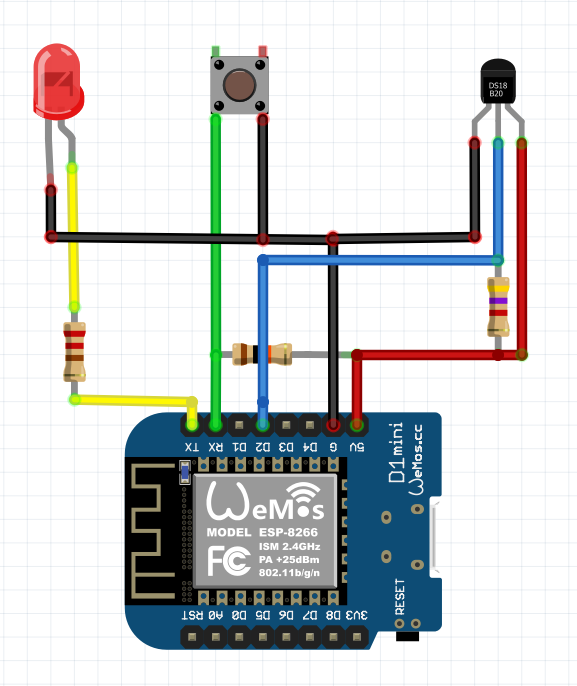

# Wi-Fi Сенсор температуры на ds18b20

Сенсор температуры на датчиках ds18b20 с отправкой данных на MQTT сервер.

### Настройка

При включении, 30 секунд пока моргает светодиод, нажать кнопку.
Запустится точка доступа со страницей настройки по адресу 192.168.4.1

### Схема

